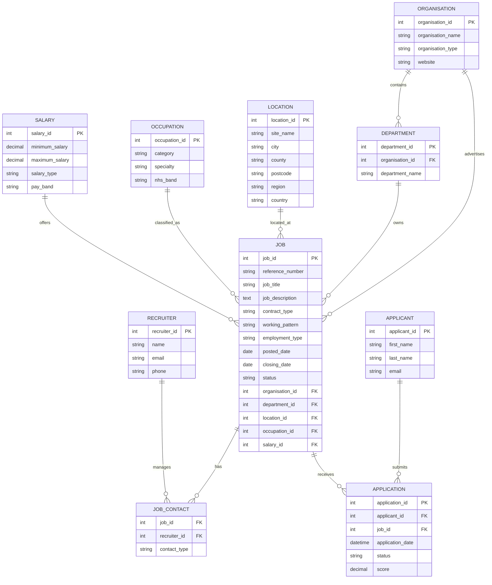

1. What tables would your database need to contain?
 
Patients, Doctors, Staff, Appointments, Trusts, Billing, Departments, Staff, Test results, Contractors, Prescriptions, Medications.
 
2. Which table will BECOME the largest over time?
 
Patients, Appointments, Medical Records.
 
3. What 5 searches do you think will happen most frequently on your DB?
 
Patients_id, Staff, Test results, Appointment_availability, Patients_History.
 
4. What data do you think would be most important and why?
 
**Patients(DATA)** (Medical records), Doctors, Trusts, Departments, appointments
 
- Patient Data contain all the importment info via medical history, diagnosis etc.

